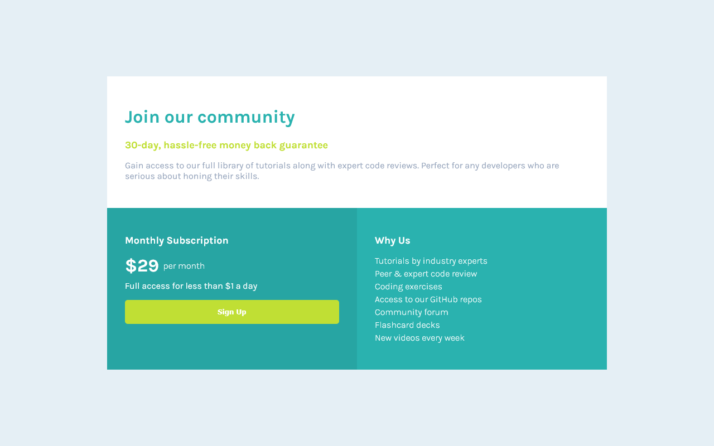

# Single Price Grid Component

A responsive pricing card component built with HTML and CSS Grid. This project showcases a clean, modern design with a three-section layout that adapts seamlessly to different screen sizes.



## 🚀 Live Demo

[View Live Project](https://404-heisenberg.github.io/Single-price-grid-component/)

## 📋 Features

- **Responsive Design**: Mobile-first approach with CSS Grid
- **Modern CSS**: Uses CSS custom properties (variables) for maintainable styling
- **Clean Layout**: Three-section card design with distinct color zones
- **Interactive Elements**: Hover effects on the CTA button
- **Typography**: Clean, readable font styling with proper hierarchy

## 🛠️ Technologies Used

- HTML5
- CSS3
- CSS Grid
- CSS Custom Properties
- Responsive Design

## 📱 Responsive Behavior

- **Mobile**: Single column layout (stacked sections)
- **Desktop**: Two-column layout with community section spanning full width

## 🎨 Design Features

- **Color Scheme**: Cyan primary with bright yellow accent
- **Typography**: Karla font family for clean readability
- **Layout**: CSS Grid with named grid areas
- **Interactions**: Smooth hover transitions on interactive elements

## 📁 Project Structure

```
Single-price-grid-component/
├── index.html
├── styles.css
├── image.png
└── README.md
```

## 🚀 Getting Started

1. Clone the repository:

   ```bash
   git clone https://github.com/404-heisenberg/Single-price-grid-component.git
   ```

2. Open `index.html` in your browser

3. Or visit the [live demo](https://404-heisenberg.github.io/Single-price-grid-component/)

## 💡 Key Learning Points

- CSS Grid layout implementation
- Responsive design with mobile-first approach
- CSS custom properties for maintainable code
- Component-based styling approach

---

\*This project was created as part of a Frontend Mentor challenge to practice CSS Grid and responsive
